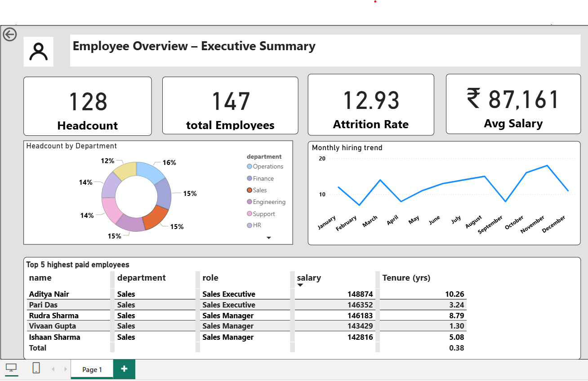

📊 Employee Overview Dashboard — Python • SQL • Power BI
This project is a complete end-to-end Data Analytics case study built using Python, PostgreSQL, and Power BI, designed to showcase real-world data cleaning, SQL analytics, and dashboard-building skills suitable for Data Analyst job roles.

📌 Project Overview
🎯 Analyze employee hiring trends, headcount, salary patterns & attrition.
📊 Build a fully interactive Power BI dashboard.
🛠 Demonstrate Python data cleaning, SQL analytics, and DAX/visualization skills.
📁 Dataset: 1000-row synthetic employee database.

■ Tools & Technologies
- Python (Pandas, NumPy)
- PostgreSQL
- Power BI
- SQL (Joins, CTEs, Window Functions)

■ Data Cleaning Steps (Python)
- Load dataset
- Standardize column names
- Handle missing values & duplicates
- Parse dates
- Create tenure and age_group fields
- Export cleaned dataset

🗄 SQL Analysis (PostgreSQL)
Included inside sql/analysis_queries.sql:
✔ CTEs for employee tenure, active employees & attrition
✔ Window functions (ROW_NUMBER, RANK, AVG OVER)
✔ Department-wise salary analysis
✔ Monthly hiring trend
✔ Top 5 highest-paid employees
✔ Headcount summary query
✔ Attrition rate calculation
✔ Join operations across employee–department tables

📊 Power BI Dashboard — Employee Executive Summary
Dashboard Features
⭐ Total Employees
⭐ Attrition Rate
⭐ Average Salary
⭐ Active vs Exited Employee Split
🍩 Department-wise Headcount (Donut Chart)
📈 Monthly Hiring Trend (Line Chart)
💼 Top 5 Highest Paid Employees (Table)
🎨 Minimal, clean UI with KPI cards

🖼 Dashboard Preview

🧠 Key Insights

📈 Hiring trend shows consistent monthly growth
🧑‍🔧 Engineering & Sales have the highest workforce share
💰 High salary skew toward senior employees
🔁 Attrition rate ~13% → indicates moderate turnover
📊 HR & Finance have stable headcount with minimal exits

🧑‍💻 What This Project Demonstrates
✔ Real-world Python data cleaning and wrangling
✔ Strong SQL analysis using joins, CTEs, window functions
✔ Power BI dashboard building & business storytelling
✔ Ability to transform raw data → insights → executive dashboard
✔ End-to-end Data Analyst workflow